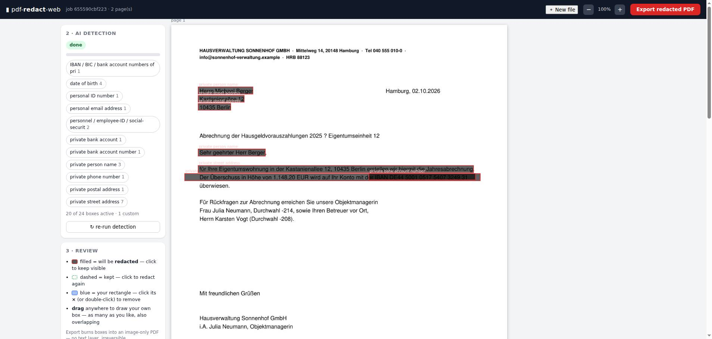

# Redact-PDF-NoOCR

LLM-based redaction of personal data in **scanned PDF documents** — no OCR anywhere
in the pipeline. A vision LLM looks at the page pixels, finds personal data, and you
review the result in a browser before anything is burned. Covered content is
**destroyed, not hidden**: the export is rebuilt as an image-only PDF with zero
extractable characters.



## Redaction policy

| | Redacted 🔴 | Stays visible 👁 |
|---|---|---|
| **Persons** | private parties: customers, owners, tenants, buyers/sellers, applicants — names, private addresses, DOB, ID numbers, private phone/email, personal bank accounts, signatures | **official persons in their function**: notaries + notary staff, judges/court employees, staff of companies/courts/authorities (role label, `i.A.`/`i.V.`/`gez.`, letterhead/signature-block context) — incl. names, titles, signatures |
| **Companies** | — | **all company data**: names, addresses, phone/fax/email, register & VAT numbers, business/escrow bank accounts |

The same person can appear in both roles (owner of a flat *and* employee of the
property manager): kept where they act officially, redacted where they appear as a
private party.

## How it works

```
scanned PDF ─ rasterize ─▶ page image
   ├─ ① vision-LLM detection (full page + 2 overlapping half-page deep crops,
   │     tight boxes + category per personal-data span)
   ├─ ② numeric widening (models cut off trailing IBAN/ID digit groups)
   ├─ ③ deterministic guards (role words, business direct-dials, containment)
   ├─ ④ policy referee: one LLM call per candidate on a context crop —
   │     "private person or company/official span?" (fail-closed → redact)
   └─ ⑤ self-verification: model inspects the BLACKENED page for leftovers
                    │
              padded / unioned boxes ── burn ──▶ image-only PDF
                    │
              ⑥ export-time leak audit (optional): fresh read of every burned page
```

Everything runs against any **OpenAI-compatible vision endpoint** — by default
Qwen3-VL via OpenRouter, or your **own self-hosted Qwen server** (see below).

## Quick start

```bash
pip install -r engine/requirements.txt     # pymupdf, Pillow, requests
cp .env.example .env                       # configure endpoint + key (below)

python3 web/server.py                      # browser UI → http://localhost:8799
# or CLI (no browser):
python3 engine/redact_pdf.py doc.pdf       # → doc_redacted.pdf + QA overlays + report
```

### Run against your own Qwen server

`.env` (project root):

```
REDACT_API_URL=http://qwen.internal.example:8000/v1/chat/completions
REDACT_MODEL=Qwen/Qwen3-VL-235B-A22B-Instruct   # model id of your endpoint
REDACT_API_KEY=...                              # any key your endpoint expects
# optional:
# REDACT_OUT_DIR=/path/to/exports               # default: ./redacted
# REDACT_PORT=8799                               # web UI port
```

Environment variables always win over `.env`.

## Browser workflow

1. **Upload** a PDF → pages rasterized (150 dpi), job persists across restarts
2. **AI detection** runs in background; boxes stream in per page with progress
3. **Review** — filled box = will be redacted, click to keep visible; drag to draw
   your own rectangles; category chips toggle whole categories
4. **Export** → burns kept boxes into an image-only PDF (irreversible, 0 extractable
   chars) + optional LLM leak audit of the burned pages

REST API documentation at `/docs` (FastAPI/Swagger).

## Demo sample

`samples/` contains a synthetic 2-page demo (business letter + notarial deed) with
all policy cases — open `demo-document.pdf` and `demo-document_redacted.pdf`
side by side. All data is fabricated.

## Safety properties

* output rebuilt from rasterized pages only — no text layer, no hidden objects
* export-time security check: extractable characters must be 0
* all model passes fail **closed**: any API/parse error leaves boxes ON
  (over-redaction, never a silent leak)
* human review before export — the LLM proposes, you dispose
* per-page QA overlays + JSON report (`<output>_review/`, `<output>.report.json`)

## Limitations (prototype)

* detection quality depends on the vision model; expect occasional
  over-redaction of institutional data (privacy-safe direction) — fix with one
  click in the review UI
* `tests/test_grounding.py` measures detection quality on a synthetic sample
  (needs an API key; ground truth via text extraction, test-only)
* encrypted PDFs are rejected; multi-page documents are fully supported
* page images leave the machine toward the configured endpoint — for
  GDPR-critical use, point `REDACT_API_URL` at your own infrastructure

## Repository layout

```
engine/   redact_pdf.py (CLI) · redactor/ (detection, referee, burn, verify)
web/      server.py (FastAPI) · static/ (review UI)
samples/  synthetic demo document + redacted result
docs/     screenshots
```

MIT License.
